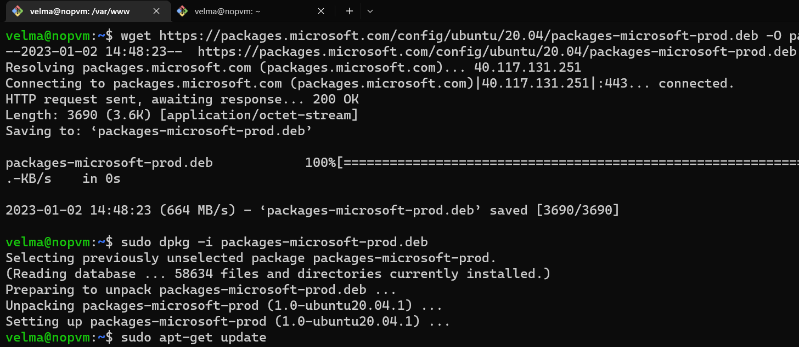
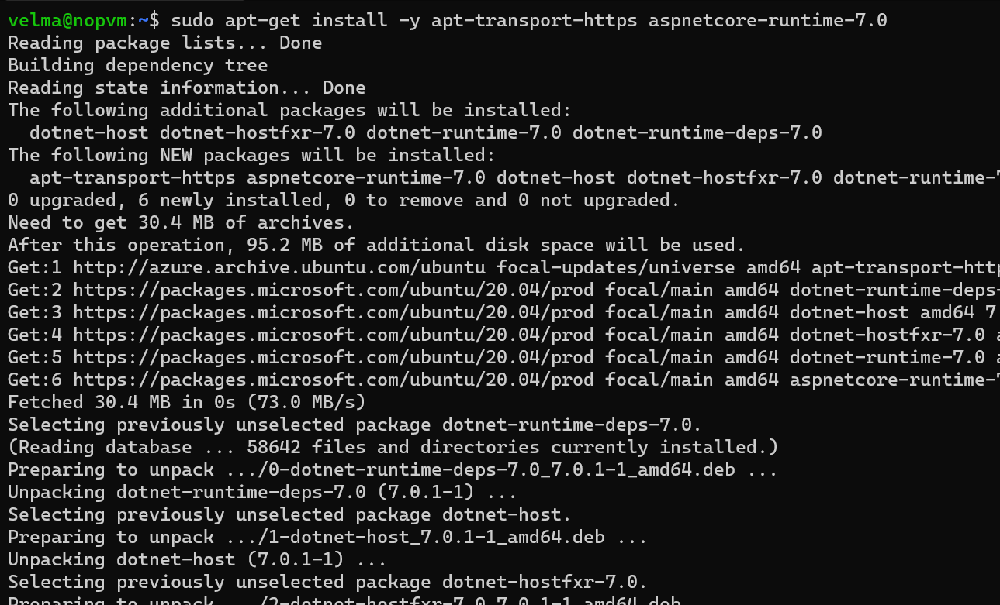
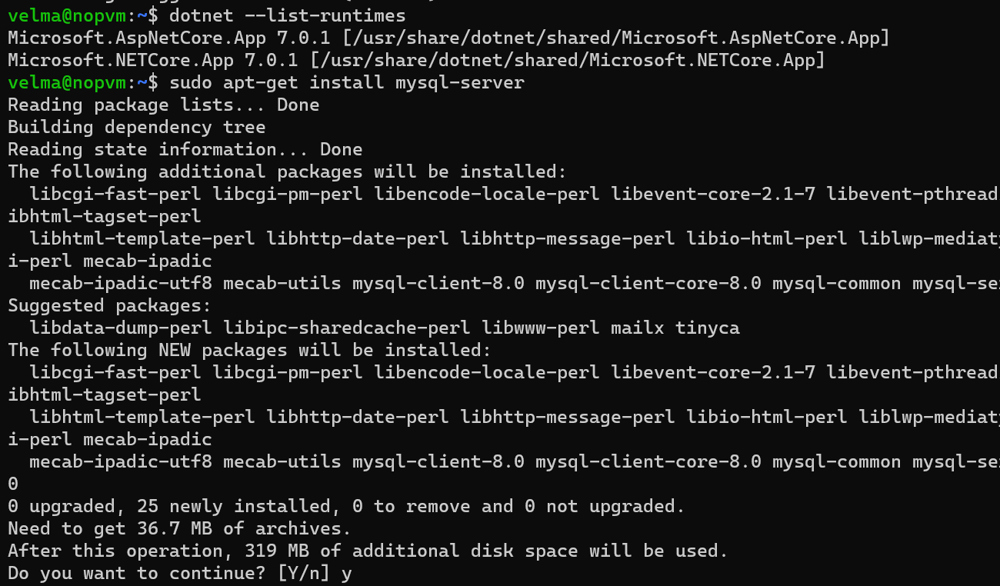
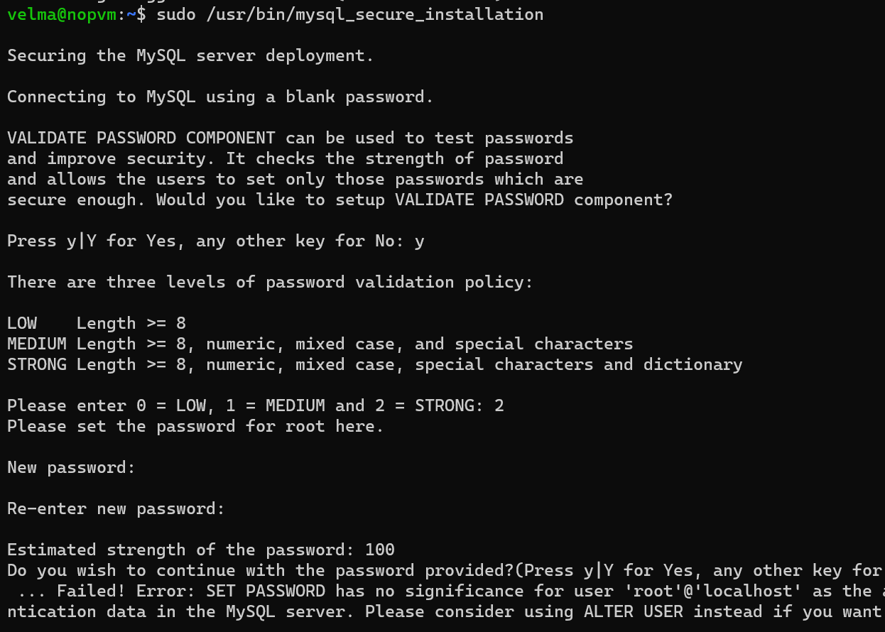
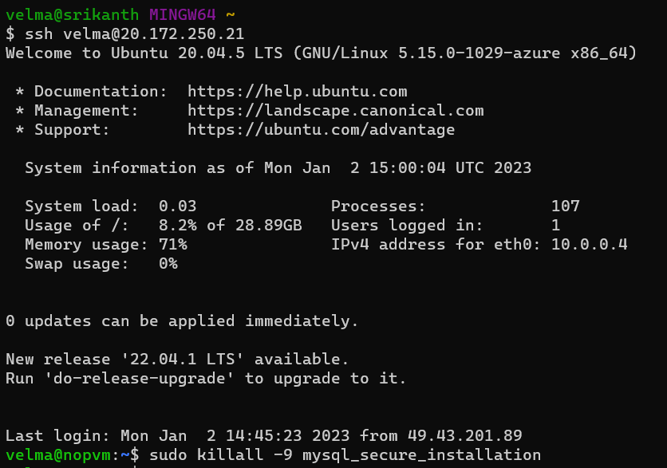
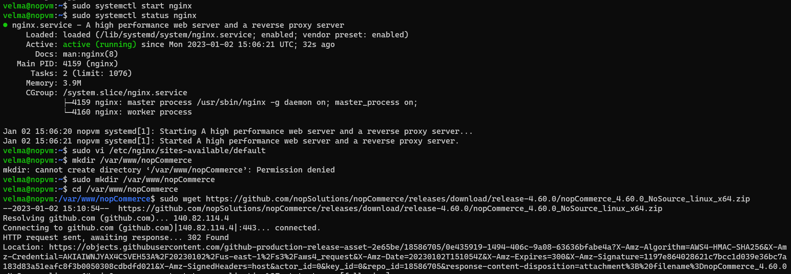
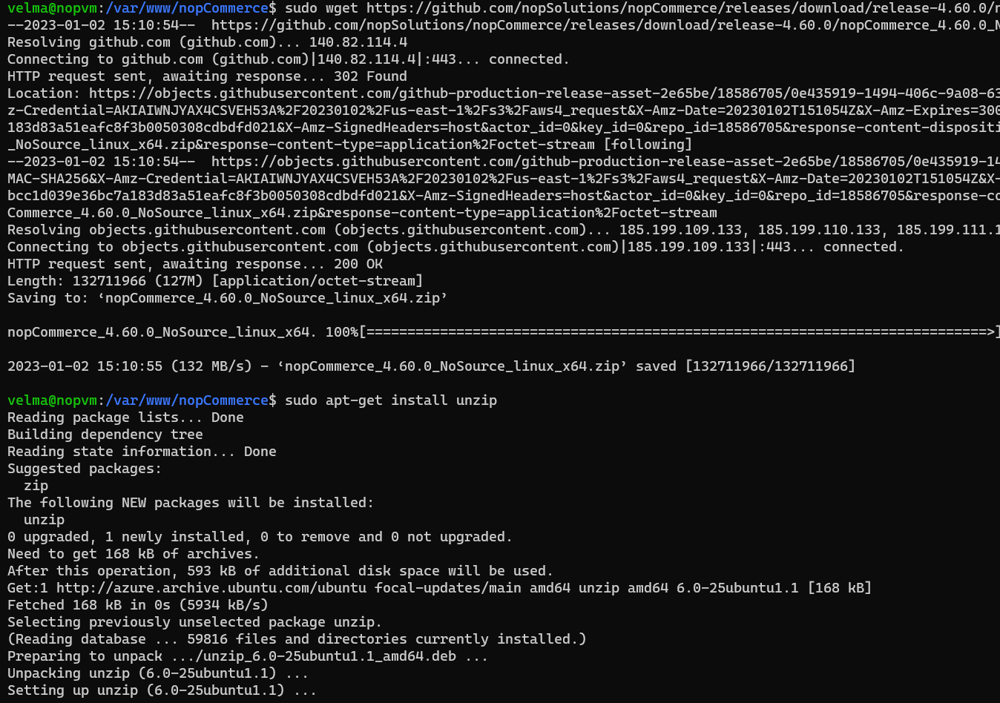
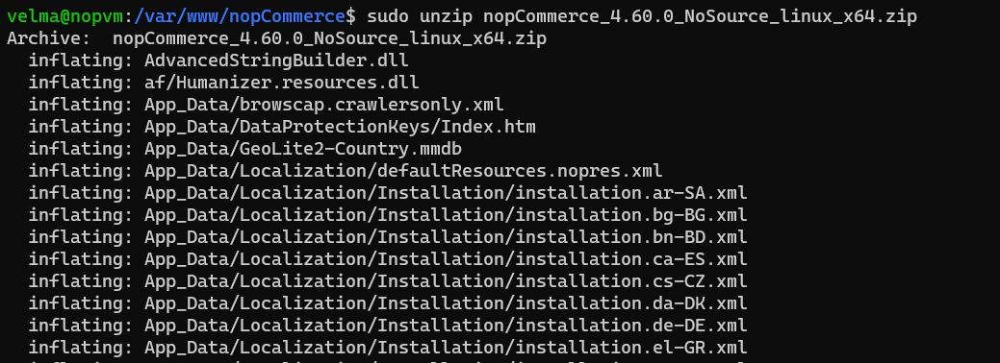
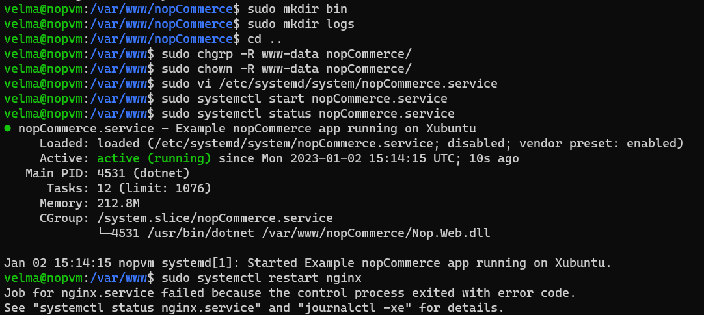

nopCommerce installation on linux
---------------------------------
[Refer]https://docs.nopcommerce.com/en/installation-and-upgrading/installing-nopcommerce/installing-on-linux.html
* This document describes how to install nopcommerce on ubuntu 20.04
### Installing required softwares
1. **register microsoft key and feed**
```
wget https://packages.microsoft.com/config/ubuntu/20.04/packages-microsoft-prod.deb -O packages-microsoft-prod.deb
sudo dpkg -i packages-microsoft-prod.deb
```


2. **install dotnet runtime** 
```
sudo apt update
sudo apt-get install -y apt-transport-https aspnetcore-runtime-7.0
```


3.**install mysqlserver**
* we need not install mysql in this server, instead we can create mysqldb server and use that for this server
* here we got difficulty for this do , when we run "**mysql_secure_installation**" step to overcome this we should run "**alteruser**"
```
sudo apt-get install mysql-server
```

By default root passwd is empty ,we have to add one and do some config 
```
sudo /usr/bin/mysql_secure_installation
```

* here we got a problem of setting password,for this we have to following options
* we have open our vm in new window and kill the process


4. **Install Nginx**


5. **Get nopCommerce**
* create a directory - /var/www/nopCommerce
```
mkdir /var/www/nopCommerce
```
* Download and unpack nopCommerce:
```
cd /var/www/nopCommerce

sudo wget https://github.com/nopSolutions/nopCommerce/releases/download/release-4.60.1/nopCommerce_4.60.1_NoSource_linux_x64.zip

sudo apt-get install unzip

sudo unzip nopCommerce_4.60.1_NoSource_linux_x64.zip
```



* Create couple directories to run nopCommerce:
```
sudo mkdir bin
sudo mkdir logs
```
* Change the file permissions:
```
cd ..
sudo chgrp -R www-data nopCommerce/
sudo chown -R www-data nopCommerce/
```
* Create the nopCommerce service
* Create the /etc/systemd/system/nopCommerce.service file with the following contents:
```
[Unit]
Description=Example nopCommerce app running on Xubuntu

[Service]
WorkingDirectory=/var/www/nopCommerce
ExecStart=/usr/bin/dotnet /var/www/nopCommerce/Nop.Web.dll
Restart=always
# Restart service after 10 seconds if the dotnet service crashes:
RestartSec=10
KillSignal=SIGINT
SyslogIdentifier=nopCommerce-example
User=www-data
Environment=ASPNETCORE_ENVIRONMENT=Production
Environment=DOTNET_PRINT_TELEMETRY_MESSAGE=false

[Install]
WantedBy=multi-user.target
```
* Start the service:
```
sudo systemctl start nopCommerce.service
``` 
* Check the nopCommerce service status:
```
sudo systemctl status nopCommerce.service
```



