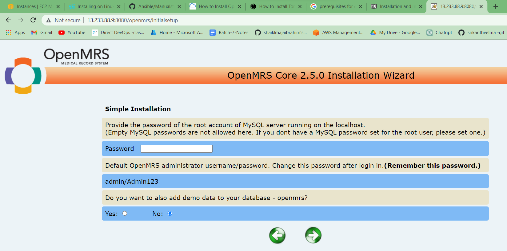

Manual steps to install OpenMRS on Ubuntu
-----------------------------------------
* Created a vm ubuntu 20.04
* java version 8 and Tomcat version 
 
### Steps
* Tomcat Installation
```
sudo apt update
sudo apt install openjdk-8-jdk -y
sudo useradd -m -U -d /opt/tomcat -s /bin/false tomcat
wget https://archive.apache.org/dist/tomcat/tomcat-7/v7.0.109/bin/apache-tomcat-7.0.109.tar.gz
sudo mkdir /opt/tomcat
sudo tar -xvzf apache-tomcat-7.0.109.tar.gz -C /opt/tomcat/ --strip-components=1
cd /opt/tomcat
sudo chgrp -R tomcat /opt/tomcat
sudo chmod -R g+r conf
sudo chmod g+x conf
sudo chown -R tomcat webapps/ work/ temp/ logs/
```
```
sudo nano /etc/systemd/system/tomcat.service
```
```
[Unit]
Description=Apache Tomcat Web Application Container
After=network.target
[Service]
Type=forking
Environment=JAVA_HOME=/usr/lib/jvm/java-1.8.0-openjdk-amd64
Environment=CATALINA_PID=/opt/tomcat/temp/tomcat.pid
Environment=CATALINA_HOME=/opt/tomcat
Environment=CATALINA_BASE=/opt/tomcat
Environment=’CATALINA_OPTS=-Xms512M -Xmx1024M -server -XX:+UseParallelGC’
ExecStart=/opt/tomcat/bin/startup.sh
ExecStop=/opt/tomcat/bin/shutdown.sh
User=tomcat
Group=tomcat
UMask=0007
RestartSec=10
Restart=always
[Install]
WantedBy=multi-user.target
```
```
sudo systemctl daemon-reload
sudo systemctl enable --now tomcat
sudo systemctl status tomcat
```
* OpenMRS installation
```
sudo mkdir /var/lib/OpenMRS
sudo chown -R tomcat:tomcat /var/lib/OpenMRS
wget https://sourceforge.net/projects/openmrs/files/releases/OpenMRS_Platform_2.5.0/openmrs.war
sudo cp openmrs.war /opt/tomcat/webapps/
sudo chown -R tomcat:tomcat /opt/tomcat/webapps/openmrs.war
```
 